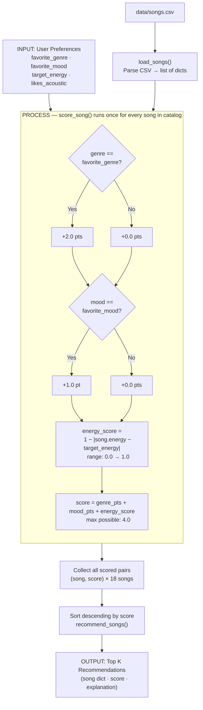
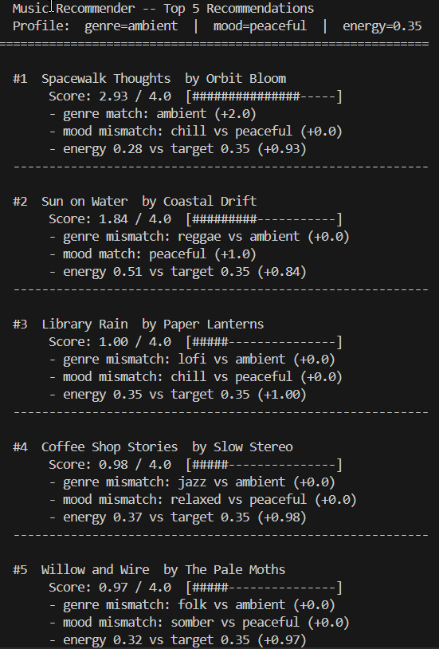

# 🎵 Music Recommender Simulation

## Project Summary

In this project you will build and explain a small music recommender system.

Your goal is to:

- Represent songs and a user "taste profile" as data
- Design a scoring rule that turns that data into recommendations
- Evaluate what your system gets right and wrong
- Reflect on how this mirrors real world AI recommenders

Replace this paragraph with your own summary of what your version does.

---

## How The System Works

Real-world recommenders like Spotify and YouTube build a profile of what a user enjoys — their preferred genres, their energy level in different contexts, their current mood — and then search their catalog for songs that best match that profile. They combine two main techniques: **content-based filtering**, which scores songs by their audio attributes, and **collaborative filtering**, which surfaces music that similar users loved. This simulation focuses on the content-based approach, which is the more interpretable of the two. Rather than learning from millions of users, it scores each song directly against a single user's stated preferences using a weighted formula, then returns the highest-scoring matches. The priority is transparency: every recommendation can be explained by pointing to the exact features that drove the score.

### Song Features

Each `Song` object stores the following attributes loaded from `data/songs.csv`:

| Feature | Type | Role in scoring |
|---|---|---|
| `id`, `title`, `artist` | Metadata | Display only — not used in similarity math |
| `genre` | Categorical | Matched against user's `favorite_genre` (binary: 1.0 or 0.0) |
| `mood` | Categorical | Matched against user's `favorite_mood` (binary: 1.0 or 0.0) |
| `energy` | Float (0–1) | Proximity score against user's `target_energy` |
| `acousticness` | Float (0–1) | Proximity score against user's `likes_acoustic` preference |
| `valence`, `danceability`, `tempo_bpm` | Float | Available but not used in the core scoring formula |

### UserProfile Features

Each `UserProfile` stores the user's taste preferences:

- **`favorite_genre`** — the genre the user most wants to hear (e.g., `"lofi"`, `"pop"`)
- **`favorite_mood`** — the user's current emotional context (e.g., `"chill"`, `"intense"`)
- **`target_energy`** — a float (0–1) representing the user's ideal energy level
- **`likes_acoustic`** — a boolean; `True` means the user prefers acoustic/organic sounds, `False` means electronic/produced

### How a Score Is Computed (Algorithm Recipe)

Each song is scored using a **point-based formula** with a maximum possible score of **4.0**:

```
score = genre_pts + mood_pts + energy_score

genre_pts    = 2.0  if song.genre == favorite_genre  else 0.0
mood_pts     = 1.0  if song.mood  == favorite_mood   else 0.0
energy_score = 1.0 - |song.energy - target_energy|        # range: 0.0 → 1.0
```

| Feature | Points | Why this weight |
|---|---|---|
| Genre match | **+2.0** | Strongest categorical preference — a genre mismatch is the hardest miss to recover from |
| Mood match | **+1.0** | Important but more contextual — a wrong mood with the right genre is still tolerable |
| Energy similarity | **0.0 → 1.0** | Continuous penalty for distance from target; rewards close matches proportionally |
| **Max total** | **4.0** | A perfect song (genre + mood + exact energy) scores 4.0 |

Genre is worth double mood because genre is a structural property of the music (its production style, instruments, tempo range), while mood is more subjective and fluid — a rock listener might accept an "intense" song even if they wanted "focused", but they won't accept jazz in place of rock.

### Data Flow

The diagram below traces a single song from the CSV file through the scoring logic to the final ranked output:



### How Songs Are Chosen

Every song in the catalog is passed individually to `score_song()`. The scores are collected into a list of `(song, score)` pairs, sorted in descending order, and the top `k` results (default: 5) are returned by `recommend_songs()`. The two functions stay cleanly separated — the scorer answers "how good is this one song?", the ranker answers "which songs do I actually surface?"

### Known Biases and Limitations

These are not bugs — they are predictable consequences of the design decisions in the Algorithm Recipe. Naming them upfront makes the system more honest.

**1. Genre over-prioritization**
Genre is worth 2.0 points while mood is worth only 1.0. This means a song that matches the user's genre but has the completely wrong mood and mediocre energy can outscore a song that nails the mood and energy but belongs to a different genre. Example: a "rock · angry" song (genre match = 2.0, mood miss, energy miss) can score up to ~2.5, while a "folk · focused" song (genre miss, mood match = 1.0, near-perfect energy = ~0.95) scores only ~1.95. The rock song wins despite being further from what the user actually wants right now.

**2. Non-matching songs are ranked by energy alone**
When a song misses on both genre and mood, it scores `0 + 0 + energy_score` — a maximum of 1.0. All 15 "wrong genre, wrong mood" songs must be ranked entirely by how close their energy is to the user's target. This collapses very different music into a single axis: a somber classical piece and a romantic r&b track end up compared as if "distance from target energy" is the only thing that separates them.

**3. Binary genre and mood matching has no sense of similarity**
`"indie pop"` and `"pop"` are treated as completely different genres — a pop fan gets 0.0 points for an indie pop song even though they might genuinely enjoy it. The same applies to mood: `"chill"` and `"relaxed"` are treated as opposites, not neighbors. A real system would assign partial credit for close-but-not-exact matches.

**4. Small catalog amplifies scarcity bias**
With only 18 songs, some moods appear just once (`"focused"` = 1 song, `"uplifting"` = 1 song). A user whose favorite mood is `"focused"` gets +1.0 for exactly one song and zero mood credit for all others. This makes the mood feature nearly useless for most of the ranking, turning it into a one-song tiebreaker rather than a meaningful signal.

**5. No diversity enforcement**
The ranker returns the top-K highest scores with no constraint on variety. For a `"lofi"` profile, recommendations 1–3 will all be lofi songs. A user might want the system to surface at least one song from outside their comfort zone — but this system never will.

---

## Sample Output



---

## Getting Started

### Setup

1. Create a virtual environment (optional but recommended):

   ```bash
   python -m venv .venv
   source .venv/bin/activate      # Mac or Linux
   .venv\Scripts\activate         # Windows

2. Install dependencies

```bash
pip install -r requirements.txt
```

3. Run the app:

```bash
python -m src.main
```

### Running Tests

Run the starter tests with:

```bash
pytest
```

You can add more tests in `tests/test_recommender.py`.

---

## Experiments You Tried

Use this section to document the experiments you ran. For example:

- What happened when you changed the weight on genre from 2.0 to 0.5
- What happened when you added tempo or valence to the score
- How did your system behave for different types of users

---

## Limitations and Risks

Summarize some limitations of your recommender.

Examples:

- It only works on a tiny catalog
- It does not understand lyrics or language
- It might over favor one genre or mood

You will go deeper on this in your model card.

---

## Reflection

Read and complete `model_card.md`:

[**Model Card**](model_card.md)

Write 1 to 2 paragraphs here about what you learned:

- about how recommenders turn data into predictions
- about where bias or unfairness could show up in systems like this


---

## 7. `model_card_template.md`

Combines reflection and model card framing from the Module 3 guidance. :contentReference[oaicite:2]{index=2}  

```markdown
# 🎧 Model Card - Music Recommender Simulation

## 1. Model Name

Give your recommender a name, for example:

> VibeFinder 1.0

---

## 2. Intended Use

- What is this system trying to do
- Who is it for

Example:

> This model suggests 3 to 5 songs from a small catalog based on a user's preferred genre, mood, and energy level. It is for classroom exploration only, not for real users.

---

## 3. How It Works (Short Explanation)

Describe your scoring logic in plain language.

- What features of each song does it consider
- What information about the user does it use
- How does it turn those into a number

Try to avoid code in this section, treat it like an explanation to a non programmer.

---

## 4. Data

Describe your dataset.

- How many songs are in `data/songs.csv`
- Did you add or remove any songs
- What kinds of genres or moods are represented
- Whose taste does this data mostly reflect

---

## 5. Strengths

Where does your recommender work well

You can think about:
- Situations where the top results "felt right"
- Particular user profiles it served well
- Simplicity or transparency benefits

---

## 6. Limitations and Bias

Where does your recommender struggle

Some prompts:
- Does it ignore some genres or moods
- Does it treat all users as if they have the same taste shape
- Is it biased toward high energy or one genre by default
- How could this be unfair if used in a real product

---

## 7. Evaluation

How did you check your system

Examples:
- You tried multiple user profiles and wrote down whether the results matched your expectations
- You compared your simulation to what a real app like Spotify or YouTube tends to recommend
- You wrote tests for your scoring logic

You do not need a numeric metric, but if you used one, explain what it measures.

---

## 8. Future Work

If you had more time, how would you improve this recommender

Examples:

- Add support for multiple users and "group vibe" recommendations
- Balance diversity of songs instead of always picking the closest match
- Use more features, like tempo ranges or lyric themes

---

## 9. Personal Reflection

A few sentences about what you learned:

- What surprised you about how your system behaved
- How did building this change how you think about real music recommenders
- Where do you think human judgment still matters, even if the model seems "smart"

